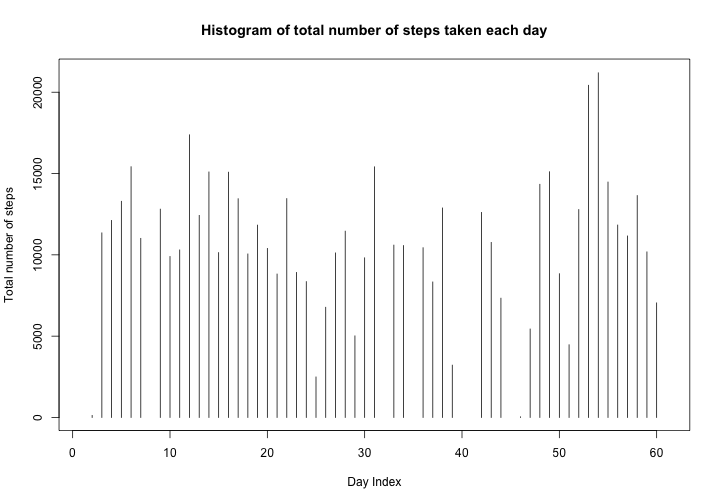
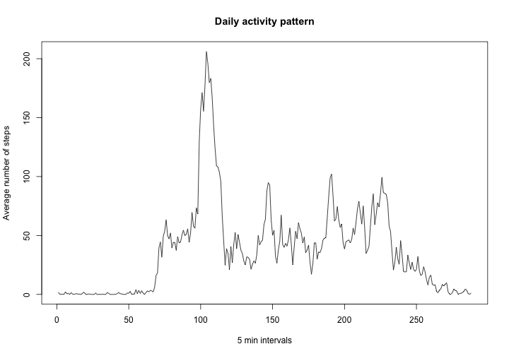
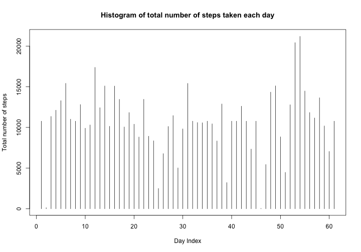
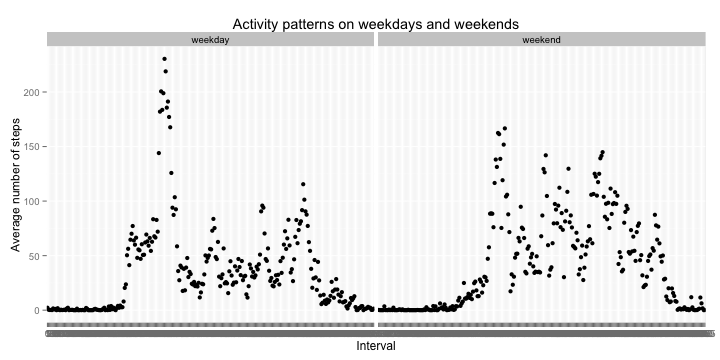

# Reproducible Research: Peer Assessment 1

## Loading and preprocessing the data

```r
datafile <- read.csv(unzip("activity.zip"))
datafile2 <- datafile[complete.cases(datafile),] # removing missing values
```

## What is mean total number of steps taken per day?

```r
sums <- tapply(datafile2$steps, datafile2$date, sum) # sum of steps per day
sums2 <- sums2<- sums[complete.cases(sums)] # remove NA
average <- as.character(round(mean(sums2)))
median <- as.character(round(median(sums2)))
```

Mean total number of steps taken per day: 10766.  
Median total number of steps taken per day: 10765  


```r
plot(sums, type="h", main="Histogram of total number of steps taken each day", 
     xlab="Day Index", ylab="Total number of steps")
```

 

## What is the average daily activity pattern?

```r
datafile2$interval <- as.factor(datafile2$interval) # convert intervals to factors
interval_means <- tapply(datafile2$steps, datafile2$interval, FUN="mean")
plot(interval_means, type="l", xlab="5 min intervals", ylab="Average number of steps",
     main="Daily activity pattern")
```

 

```r
max <- names(which.max(interval_means))
```

5 minute interval with maximum number of steps on average is: 835  

## Imputing missing values


```r
missing <- sum(!complete.cases(datafile))
```
The total number of missing values is: 2304

```r
# Replace all NA steps from the original dataframe with the mean for that interval
names <- rownames(datafile)
for (i in seq_along(names)){
        if (is.na(datafile[i,1])){
                interval <- datafile[i,3]
                interval_means_df <- as.data.frame(interval_means)                
                datafile[i,1]<- interval_means_df[rownames(interval_means_df)==interval,1]
        }
}
# Re-plot the histogram and re-calculate mean and median for total number of steps
sums_i <- tapply(datafile$steps, datafile$date, sum) # sum of steps per day
mean_i <- as.character(round(mean(sums_i)))
median_i <- as.character(round(median(sums_i)))
plot(sums_i, type="h", main="Histogram of total number of steps taken each day", 
     xlab="Day Index", ylab="Total number of steps")
```

 

Mean number of steps taken per day (after imputation): 10766.   
Median number of steps taken per day (after imputation): 10766 

## Are there differences in activity patterns between weekdays and weekends?


```r
# Add a column with a factor variable for weekday/weekend
datafile$date <- as.Date(datafile$date)
days<- weekdays(datafile$date)
for (i in seq_along(days)) {
        if(days[i] == "Saturday"){days[i] <- "weekend"}
        else if (days[i] == "Sunday"){days[i] <- "weekend"}
        else{days[i] <- "weekday"}
        }
datafile$weekend <- as.factor(days)

# Plot average number of steps over intervals on weekdays/weekends
library(ggplot2)
library(reshape2)
datafile$interval <- as.factor(datafile$interval)
# Summarizing the data frame to report means per interval over weekday/weekend
new_frame <- melt(datafile, id=c("interval", "weekend"), measure.vars="steps")
summary <- dcast(new_frame, interval+weekend ~ variable, mean)
qplot(interval, steps, data=summary, facets=.~weekend, main="Activity patterns on weekdays and weekends",xlab="Interval", ylab="Average number of steps")
```

 

